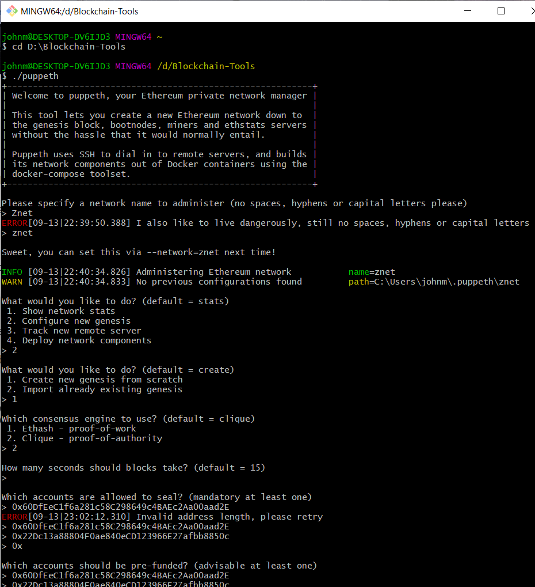
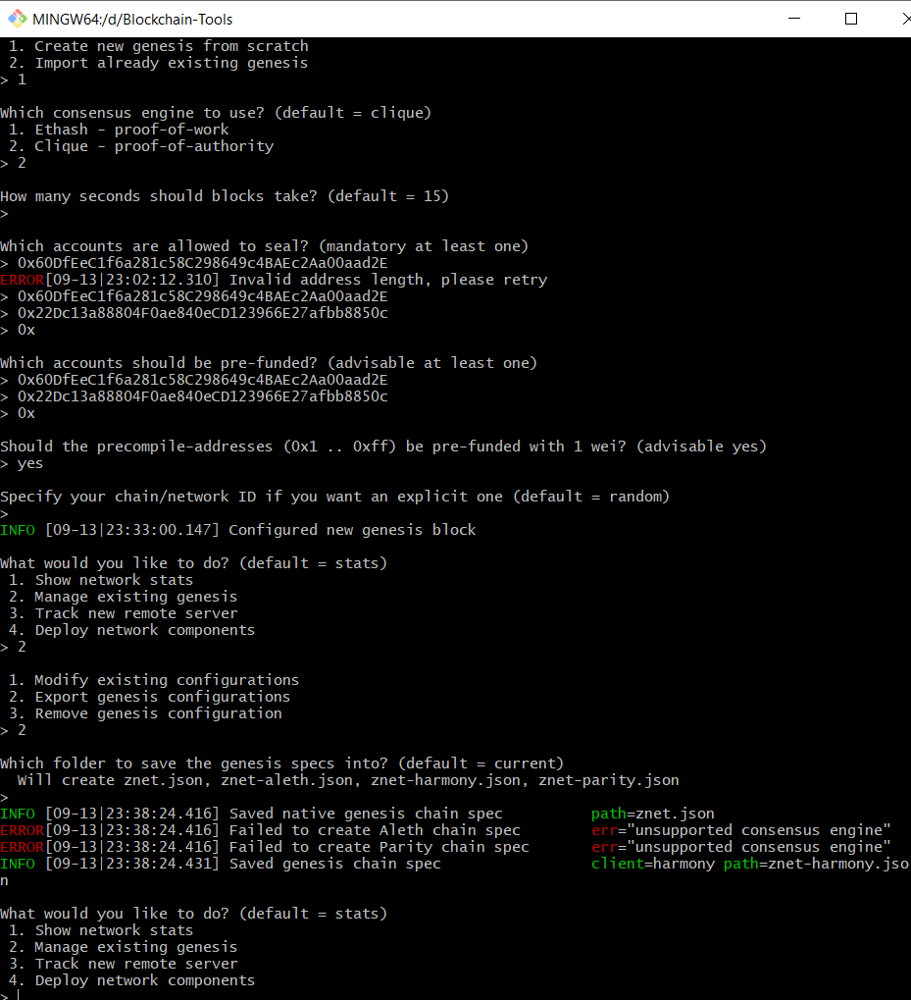
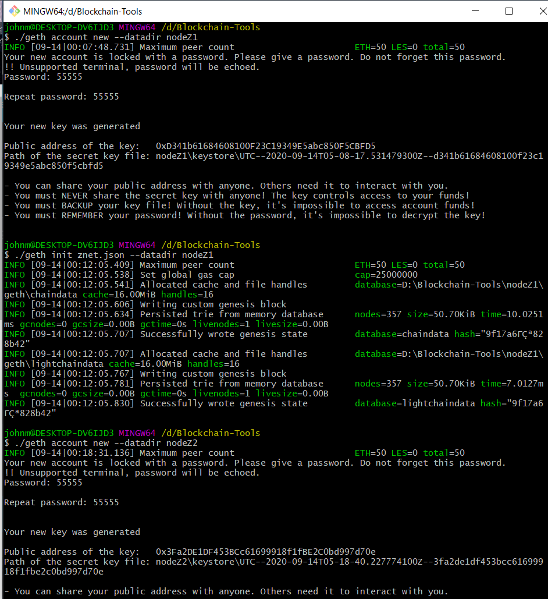
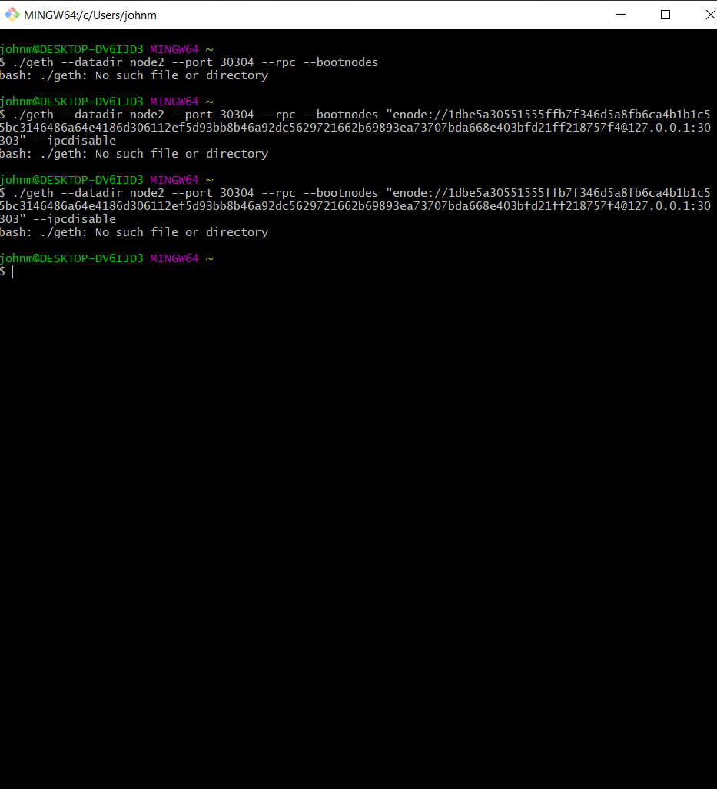
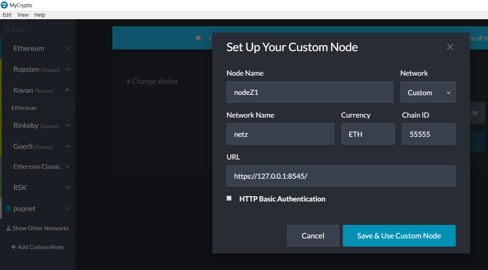
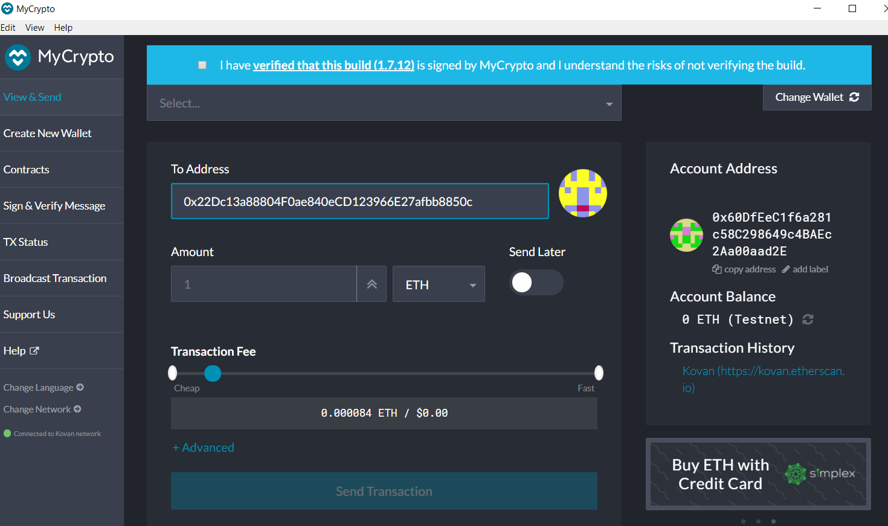

# out-of-the-box-blockchain
Instructions to setup new blockchain

## Create Folder with Blockchain-Tools

> D:\Blockchain-Tools

## Run puppeth on GitBash

Open GitBash

set location to folder with Blockchain-Tools
$ cd D:\Blockchain-Tools

Run puppeth
$ ./puppeth

Set network name
> znet

## Configure zneth

Select new genesis
2. Configure new gensis
> 2
> Enter

Select create from scratch
1. Create new genesis from scratch
> 1
> Enter

Select proof-of-authority
2. Clique - proof-of-authority
> 2
> Enter

Leave time for blocks at 15
>
> Enter

## Set accounts allowed to seal

### Addresses
> 0x60DfEeC1f6a281c58C298649c4BAEc2Aa00aad2E
> Enter
> 0x22Dc13a88804F0ae840eCD123966E27afbb8850c
> Enter

Should the precompile-addresses be pre-funded
> yes
> Enter

Sprcify your chain/network ID if you want...
>
> Enter

## Manage esisting genesis options
2. Manage existing genesis
> 2
> Enter

### Setup Images

## Set up nodes and initialize

First node for mining
$ ./geth account new --datadir nodeZ1

Set password: 55555

Results:
> Public address: 0xD341b61684608100F23C19349E5abc850F5CBFD5
> Path of key: nodeZ1\keystore\UTC--2020-09-14T05-08-17.531479300Z--d341b61684608100f23c19349e5abc850f5cbfd5

Initialize (znet nodeZ1):
$ ./geth init znet.json --datadir nodeZ1

Initialize (znet nodeZ2):
$ ./geth account new --datadir nodeZ2
> Public address: 0x3Fa2DE1DF453BCc61699918f1fBE2C0bd997d70e
> Path of key: nodeZ2\keystore\UTC--2020-09-14T05-18-40.227774100Z--3fa2de1df453bcc61699918f1fbe2c0bd997d70e

$ ./geth init pupnet.json --datadir nodeZ2

### Initialization image

## Start First Node

Start nodeZ1
$ ./geth --datadir nodeZ1 --mine --minerthreads 1

### enode
enode://1dbe5a30551555ffb7f346d5a8fb6ca4b1b1c55bc3146486a64e4186d306112ef5d93bb8b46a92dc5629721662b69893ea73707bda668e403bfd21ff218757f4@127.0.0.1:30303

## Start Second Node
./geth --datadir node2 --port 30304 --rpc --bootnodes "enode://1dbe5a30551555ffb7f346d5a8fb6ca4b1b1c55bc3146486a64e4186d306112ef5d93bb8b46a92dc5629721662b69893ea73707bda668e403bfd21ff218757f4@127.0.0.1:30303" --ipcdisable

### Error image

## Set up network

### Open MyCrypto

Select: Change Network

Select: + Add Custom Network

Set the following for the Node / Network setup
Node Name: nodeZ1
Network DDLB: Custom
Network Name: netz
Currency: ETH
Chain ID: 55555
URL: https://127.0.0.1:8545/

Select: Save & Use Custom Node

### MyCrypto Transfer

Open Wallet:
Select account for nodeZ1: 0x60DfEeC1f6a281c58C298649c4BAEc2Aa00aad2E
To Address (nodeZ2): 0x22Dc13a88804F0ae840eCD123966E27afbb8850c
Amount: 1 ETH default
Currency: ETH default
Transaction Fee: default

